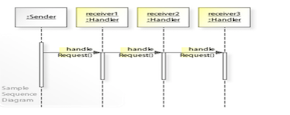

# Behavioral Patterns Pt.1

## Minute-by-Minute

| **Elapsed** | **Time**  | **Activity**              |
| ----------- | --------- | ------------------------- |
| 0:00        | 0:05      | Objectives                |
| 0:05        | 0:15      | Overview                  |
| 0:20        | 0:45      | In Class Activity I       |
| 1:05        | 0:10      | BREAK                     |
| 1:15        | 0:45      | In Class Activity II      |
| TOTAL       | 2:00      |                           |


## Learning Objectives (5 min)

By the end of this lesson, you should be able to...

1. Describe:
- the **Chain-of-Responsibility** and **Command** patterns
- the software construction problem each is intended to solve
- potential use cases for each (when to use them)
3. Assess:
- the suitability of a given design pattern to solve a given problem
- the trade offs (pros/cons) inherent in each
4. Implement basic examples of both patterns explored in this class


## Initial Exercise (15 min)


- Quiz on homework or topic(s) of past class


## Overview/TT I (20 min)

### Behavioral Patterns

In software engineering, **Behavioral** design patterns are design patterns that identify common communication patterns between objects and realize these patterns.

By doing so, these patterns increase flexibility in carrying out this communication.

__*Source:*__ *wikipedia.org*


Though there are many more to explore, we will focus on these two key Behavioral patterns in this lesson and the next:

- Chain of Responsibility
- Command

### Chain-of-Responsibility

The __*Chain-of-Responsibility*__ pattern is a behavioral design pattern that allows an event to be processed by one of many handlers.

It consists of a source of command objects and a series of processing objects.

Each processing object contains logic that defines the types of command objects that it can handle; the rest are passed to the next processing object in the chain.

__*Source:*__ *wikipedia.org*





#### Problems Addressed

Implementing a request directly within the class that sends the request is inflexible because it couples the class to a particular receiver and makes it impossible to support multiple receivers.

It should be possible that more than one receiver can handle a request.

Chain-of-Responsibility decouples the sender of a request to its receiver.

#### How to Implement
You define a chain of *receiver* objects having the responsibility, depending on run-time conditions, to either *handle a request* or *forward it to the next receiver* on the chain (if any).

This enables sending a request to a __*chain*__ of receivers *without* having to know which one handles the request. The request gets passed along the chain until a receiver handles the request. The __*sender*__ of a request is __*no longer coupled*__ to a particular receiver.

### When should you use it?

- Use this pattern whenever you have a group of related objects that handle similar events but vary based on event type, attributes, user choices/input, or anything else related to the event.


### Key Example Use Case

The Cocoa and Cocoa Touch frameworks actively use the chain-of-responsibility pattern for handling events.

Objects that participate in the chain are called __*responder objects,*__ inheriting from the `UIResponder` (iOS) class.

__*All view objects*__ (UIView), view controller objects (UIViewController), window objects (UIWindow), and the application object (UIApplication) __*are responder objects*__

Typically, when a view receives an event it can’t handle, it dispatches it to its superview until it reaches the view controller or window object. If the window can’t handle the event, the event is __*dispatched*__ to the __*application object,*__ which is __*the last object in the chain.*__

**On iOS,** it’s __*typical to handle view events in the view controller*__ which manages the view hierarchy, instead of subclassing the view itself. Since a view controller lies in the responder chain after all of its managed subviews, it can intercept any view events and handle them.

__*Source:*__ *wikipedia.org*


__*Source:*__ *Apple, Inc.*


## In Class Activity I (30 min)

Every UIResponder object has a method called `next()` which returns the next responder in the responder chain (or `nil` if there is no next responder). The next responder of a view is typically its view controller or its superview (if it has no view controller).

A responder object can choose *not* to handle an event simply by forwarding the event message to its *next responder.*

**TODO:** Using the pre-made [TouchResponder starter app](https://github.com/Make-School-Labs/StarterApp-MOB-2.4-L03), add code to pass a double-tap touch event to the view's next responder object (the view controller).

#### Part 1: Tracing Framework Ancestry

1. Download the [TouchResponder starter app](https://github.com/Make-School-Labs/StarterApp-MOB-2.4-L03)

2. Open the `TouchableView.swift` file and __*Jump to Definition*__ `[Ctrl+Cmd+Click]` the `UIView` in the class declaration on line 16
```Swift
class TouchableView: UIView {
```
...this will open the `UIView` definition/header file in the `UIKit` framework and display the `UIView class's` structural declaration...

```Swift
@available(iOS 2.0, *)
open class UIView : UIResponder, NSCoding, UIAppearance, UIAppearanceContainer, UIDynamicItem, UITraitEnvironment, UICoordinateSpace, UIFocusItem, UIFocusItemContainer, CALayerDelegate {
  ```
...notice how `UIView` extends the `UIResponder` class (and conforms to a long list of protocols).

- `[Ctrl+Cmd+Click]` on `UIResponder` to see how it is constructed:

```Swift
  @available(iOS 2.0, *)
  open class UIResponder : NSObject, UIResponderStandardEditActions {

      open var next: UIResponder? { get }
```

...take a peek at `UIResponder's` properties, especially `next: UIResponder?` variable...    

3. Open the `ViewController.swift` file and __*Jump to Definition*__ `[Ctrl+Cmd+Click]` the `UIViewController` in the class declaration on line 11
```Swift
class ViewController: UIViewController {
```

...and notice that the `ViewController` class definition also extends the `UIResponder` class...

```Swift
@available(iOS 2.0, *)
open class UIViewController : UIResponder, NSCoding, UIAppearanceContainer, UITraitEnvironment, UIContentContainer, UIFocusEnvironment {
```

#### Part 2: Handing Off Responsibility to the Next Responder

1. Reopen the `TouchableView.swift` file in the [TouchResponder starter app](https://github.com/Make-School-Labs/StarterApp-MOB-2.4-L03)

The `touchesBegan(_:_:)` function of the `TouchableView` class is currently set up to respond to all touches to its view.

You will need to add a conditional statement which will, in the event a double-tap occurs, forward that event to the view's next responder.

Each Touch object captures the number of taps in its tapCount property.

**a)** For Double-Tap Events:

If the Touch object's `tapCount == 2`, then:

- log that conditional state:

```Swift
 print("Double Tap Began")
 ```

- and handoff the responsibility of handling the event to next responder's `touchesBegan(_:_:)` function and *log the identity of the next Responder*.

- also in the event of a double-tap, log the identify of the view's next.next responder.

**b)** For Single Taps:

- just log that state in the conditional:

```Swift
print("Single Tap Began")
```


<!-- Completed touchesBegan(_:_:) function:

 override func touchesBegan(_ touches: Set<UITouch>, with event: UIEvent?) {

        // To see the order of events, log this function name
        print(#function)

        let touch = touches.first!

        // handle double-taps
        if touch.tapCount == 2 {

            print("Double Tap Began")

            // 1) handoff to next responder and print identity of next responder
            next?.touchesBegan(touches, with: event)
            print(next as Any)

            // 2) print identity of next.next responder
//            next?.next?.touchesBegan(touches, with: event)
            print(next?.next as Any)

        } else { // handle touches that are not double-taps
              print("Single Tap Began")
        }

        /** location() function -- returns the current location of a UITouch object in the coordinate system of the specified view **/
        print(touch.location(in:self))
        print(touch.location(in:self.window!))
//        print(touch.location(in:nil))
    }
    -->
    
**c)** Use the Debug View Hierarchy Tool

- Set a couple of breakpoints to capture the double-tap condition, run the app, and tap on the view.

- When Xcode stops at your breakpoint, click on the View Debug Hierarchy icon:


Experiment with sliders to examine their effect.

And **pay very close attention** to the hierarchy of views presented in your Navigation pane. This shows the relationships between the UIResponder objects that can currently participate in the view's Responder Chain (with the exception of the Application and AppDelegat options, which are not shown):


**For The More Curious**
1. Using the Debug View Hierarchy tool on this simple example reveals little of the powerful utility this tool can have in analyzing your code. Apply this tool to some of your actual projects that have complex UI structures to understand more of how it can be used.
2. Apple has long provided ways to analyze view hierarchies. In addition to the Debug View Hierarchy tool, there is more than one command-line debugging phrase which can be used to analyze the view hierarchy of your app.

By setting a breakpoint and executing this command in your debug pane:

```Swift
expr -l objc++ -O -- [UIViewController _printHierarchy]
```

... you can also return information about the state of your current view hierarchy:


#### Part 3: Class Discussion

**Q** How does this Next Responder approach serve to decouple the sender from the receiver?

**Q:** In what ways could this CoR approach be useful in your own work?


## Overview/TT II (optional) (20 min)

### Command

 *Command* is a design pattern in which an object is used to encapsulate all information needed to perform an action or trigger an event at a later time. This information includes the method name, the object that owns the method and values for the method parameters

 It seeks to encapsulate information to perform an action into a command object.

 It involves three components types:

 - The invoker stores and executes commands.

 - The command encapsulates the action as an object.

 - The receiver is the object that’s acted upon by the command.

The pattern allows you to *model* the concept of executing an action.


#### Problems Addressed

It should be possible to configure an object (that invokes a request) with a request.
Implementing (hard-wiring) a request directly into a class is inflexible because it couples the class to a particular request at compile-time, which makes it impossible to specify a request at run-time.


#### Benefits

 Using command objects makes it easier to construct general components that need to delegate, sequence or execute method calls at a time of their choosing without the need to know the class of the method or the method parameters.

 Using an invoker object allows bookkeeping about command executions to be conveniently performed, as well as implementing different modes for commands, which are managed by the invoker object, without the need for the client to be aware of the existence of bookkeeping or modes.

__*Source:*__ *wikipedia.org*


#### When to use it?
Use the Command pattern whenever you want to create actions that can be executed on receivers at a later point in time. For example, you can create and store commands to be performed by a computer AI, and then execute these over time.


## In Class Activity II (optional) (30 min)

<!-- TODO: -->

## After Class

1. Review the other Behavioral Patterns in the links below
2. xxx

<!-- Look up:
- Composite pattern
-->

## Wrap Up (5 min)

1) Brief summary of today's design Patterns
2) Any questions re: the After Class assignments above

## Additional Resources

1. [Behavioral Patterns - an article](https://sourcemaking.com/design_patterns/behavioral_patterns)
2. [Behavioral pattern - wikipedia](https://en.wikipedia.org/wiki/Behavioral_pattern)
3. [Chain-of-Responsibility - wikipedia](https://en.wikipedia.org/wiki/Chain-of-responsibility_pattern)
4. [Command pattern - wikipedia](https://en.wikipedia.org/wiki/Command_pattern)
5. [Intermediate Design Patterns in Swift - Ray Wenderlich](https://www.raywenderlich.com/2102-intermediate-design-patterns-in-swift)
6. [Using Responders and the Responder Chain to Handle Events - from Apple](https://developer.apple.com/documentation/uikit/touches_presses_and_gestures/using_responders_and_the_responder_chain_to_handle_events)
