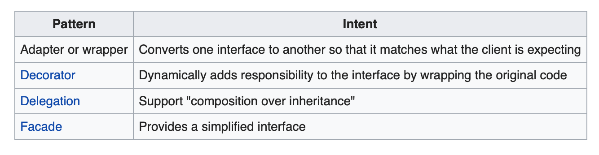

# Structural Patterns Pt.1

<!-- INSTRUCTOR NOTES:
1) For the quiz in the Initial Exercise:
- the URL is xxxx
2) For Activity 1:
- xxxx
3) for Activity 2:
- xxx
-->

## Minute-by-Minute

| **Elapsed** | **Time**  | **Activity**              |
| ----------- | --------- | ------------------------- |
| 0:00        | 0:05      | Objectives                |
| 0:05       | 0:15      | Initial Exercise             |
| 0:20       | 0:15      | Overview  I                |
| 0:35       | 0:20      | In Class Activity I       |
| 0:55        | 0:10      | BREAK                     |
| 1:05         | 0:15      | Overview  II                |
| 1:20       | 0:25      | In Class Activity II      |
|1:45       | 0:05    | Wrap Up                     |
| TOTAL       | 1:50    |                          |


## Why you should know this...

<!-- Why Structural
- why these 2 patterns -->


## Learning Objectives (5 min)

By the end of this lesson, you should be able to...

1. Explain why **Structural design patterns** are important in software development
2. Describe:
- the **Adapter** and **Decorator** patterns
- the software construction problem each is intended to solve
- potential use cases for each (when to use them)
3. Assess:
- the suitability of a given design pattern to solve a given problem
- the trade offs (pros/cons) inherent in each
4. Implement basic examples of both patterns explored in this class


## Initial Exercise (15 min)

### Part 1 - Individually


<!-- Quiz location:

TODO: Add quiz answers

-->

### Part 2 - In Pairs

Grade each other's quizzes, sharing answers, insights, etc.

## Overview/TT I (20 min)


### Structural Patterns
Structural design patterns ease design by identifying a simple way to realize relationships between entities.

Examples of Structural patterns include:
- **Adapter**
- Aggregate
- Bridge
- Composite
- **Decorator**  
- Extensibility
- **Facade**
- Flyweight  
- Marker
- **Proxy**

*From: wikipedia*

*For lessons 5 and 6 in this course, we will cover the patterns highlighted in bold text above…*

**Structural Pattern Notes:**
1. MVC is a high-level example of a Structural pattern.
2. Many of the structural patterns have similar implementations but different intents. Best practice: Ensure you select the Structural pattern which best suits your intended purpose.
2. Adapter and Decorator are often each referred to as “wrapper” patterns because they wrap an object and provide a new interface around it. Here are some key differences between the two patterns:
- **Adapter** -- Can be used when the wrapper must respect a particular interface and must support polymorphic behavior.
- **Decorator** makes it possible to add or alter behavior of an interface at run-time.
- **Facade** is used when an easier or simpler interface to an underlying object is desired. *(We will learn more about Facade in next lesson.)*




### The Adapter Pattern


#### Implementation Notes

The key idea in this pattern is to work through a separate adapter that adapts the interface of an (already existing) class without changing it.


Adaptee: Defines an existing interface that needs adapting.
Adapter: Adapts the interface of Adaptee to the Target interface.
Target: Defines the domain-specific interface that Client uses.
Client: Collaborates with objects conforming to the Target interface.


Three components:

Adaptee
The object we are adapting to a specific target (eg. old-school USB-A port).

Adapter
An object that wraps the original one and produces the new requirements specified by some target interface (this does the actual work, aka. the little dongle above).

Target
It is the object we want to use adaptee with xxx

Best Practices in Swift:
-

#### Simple example

```swift
// Adaptee
class Hobbit {
    func walk() {
        print("Hobbit is walking few steps")   
    }    
}

// Target
protocol GuardianOfTheCitadel {
    func march()
}

// Adapter
extension Hobbit: GuardianOfTheCitadel {
    func march() {
        walk()
        walk()
    }
}

//
let citadel = Citadel(guardians: [Guardian(), Guardian(), Hobbit(), Guardian()])
```


<!-- good potetial example:

https://theswiftdev.com/2018/07/30/swift-adapter-design-pattern/

has Simple and Object adapter ...

https://medium.com/jeremy-codes/adapter-pattern-in-swift-7332e178f112


-->


#### Problems Addressed

Often an (already existing) class can't be reused only because its interface doesn't conform to the interface clients require.


#### Benefits


#### Pitfalls


#### When to use

It’s very often used in systems based on some legacy code.


## In Class Activity I (30 min)

- I do, We do, You do
- Reading & Discussion Questions in small groups
- Draw a picture/diagram
- Complete Challenges solo or in pair
- Q&A about tutorials
- Pair up and code review
- Pair program
- Formative assessment
- Form into groups
- etc (get creative :D)

## Overview/TT II  (20 min)

#### Description


#### Implementation


#### Problems Addressed


#### Benefits
.
- Why learn this?
- Industry examples of usage
- Best practices
- Personal anecdote

#### Pitfalls
.

#### When to use


You can use an adapter if you want to integrate a third-party library in your code, but it's interface doesn't match with your requirements.

Another use case is when you have to use several existing final classes or structs but they lack some functionality and you want to build a new target interface on top of them. Sometimes it's a good choice to implement an wrapper to handle this messy situation


## In Class Activity II  (30 min)

## Wrap Up (5 min)

- Continue working on your current tutorial
- Complete reading
- Complete challenges

## Additional Resources

1. Links to additional readings and videos
