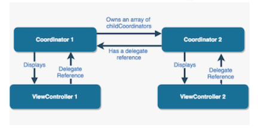

# Coordinators

<!-- INSTRUCTOR NOTES:
1) For the QuizLet Game in the Initial Exercise:
- the URL is xxxx
2) For Activity 1:
- solutions are hidden below Additional Resources
3) for Activity 2:
- xxxx
-->

## Minute-by-Minute

| **Elapsed** | **Time**  | **Activity**              |
| ----------- | --------- | ------------------------- |
| 0:00        | 0:05      | Objectives                |
| 0:05        | 0:20      | Initial Exercise          |
| 0:25        | 0:20      | Overview                  |
| 0:45        | 0:15      | In Class Activity I       |
| 1:00        | 0:10      | BREAK                     |
| 1:10        | 0:20      | Overview                  |
| 1:30        | 0:25      | In Class Activity II      |
| TOTAL       | 1:55      |                           |


## Learning Objectives (5 min)

By the end of this lesson, you should be able to...

1. Describe:
- the **Coordinator** design pattern
- the software construction problem(s) it is intended to solve
- potential use cases for it (when to use it; when not to use it)
- how to implement Coordinator in iOS
3. Assess:
- the suitability of a given design pattern to solve a given problem
- the trade offs (pros/cons) inherent in choosing high-level (MVC, MVVM, etc.) design patterns
4. Design and implement basic examples of **Coordinator** explored in this class


## Initial Exercise (15 min)

### As A Class

1. Review After Class assignment from Lesson 7
- students demo their solutions

## Overview/TT I (20 min)

### The Coordinator Pattern

The idea behind the Coordinator pattern is the creation of a separate entity &mdash; __*a Coordinator object*__ &mdash; which is responsible for the application’s *flow.*

*So what is a coordinator?*

>
> A **coordinator** is an object that bosses one or more view controllers around.
>
> A **coordinator** is an object that encapsulates a lifecycle that is spread over a collection of view controllers.
>


&nbsp;&nbsp;&nbsp;&nbsp;&nbsp;&nbsp;&nbsp;&nbsp; *Source:* [Coordinators Redux](http://khanlou.com/2015/10/coordinators-redux/) &mdash; Soroush Khanlou<sup>1</sup>


The Coordinator encapsulates a part of the application. A Coordinator knows nothing of its parent Coordinator, but it can start its child Coordinators.

Similar to how UIViewControllers manage UIViews, Coordinators can manage UIViewControllers taking all of the driving logic (navigation) out of view controllers and moving it up one level &mdash; to a __*Coordinator layer.*__




<!-- TODO: Attribute graphic -->


### Problems Addressed

1. **The Pushing Problem**

One of the standard ways to perform navigation on iOS is to use a `UINavigationController` onto which each view controller can either pop or push other view controllers.

Most iOS developers have implemented this type of navigation a hundred or more times:

```Swift
if let vc = storyboard?.instantiateViewController(withIdentifier: "SomeVC") {
    navigationController?.pushViewController(vc, animated: true)
}
```
__*The Problem*__

When the view controllers themselves must decide the next view controller to push onto `self.navigationController`,
the View controllers are too tightly coupled.

As an app grows, this approach becomes difficult to deal with: The codebase will be hard to change and maintain, and view controllers are almost impossible to reuse.

What if...
- you need to be able to navigate to the same view controller from multiple places?
- you want to implement something like deep linking from outside your app?

<!--
```Swift
class ImageListViewController: UITableViewController {
    override func tableView(_ tableView: UITableView,
                            didSelectRowAt indexPath: IndexPath) {
        let image = images[indexPath.row]
        let detailVC = ImageDetailViewController(image: image)
        navigationController?.pushViewController(detailVC, animated: true)
    }
}
```

```Swift
class MyViewController : UIViewController {

    // ...
    @IBAction func didTap(_ button: Any) {

        let newViewController = NextViewController()
        self.navigationController?.pushViewController(viewController, animated: true)
    }
}
``` -->

2. **Massive View Controller Problem** &mdash; (see previous lesson for description and example)

3. **Reusability** &mdash;

4. **Tight Coupling** &mdash;

5. **Deep Linking Issues** &mdash;


### Implementation Notes

A solid, basic implementation of coordinators includes 3 main steps:
1. Design two protocols:
- __*Coordinator Protocol*__ - To be used by all our coordinators.
- __*View Controller Creation Protocol*__ - To facilitate view controller creation.
2. Create a __*main coordinator*__ that will control app flow. Start it when your app launches.
3. Create/present view controllers.

**About the Coordinator Protocol**

All coordinators will conform to this protocol. At bare minimum, it should include:
- A property to store any child coordinators. Coordinator responsibility is to handle navigation flow: the same way that UINavigationController keeps reference of its stack, Coordinators do the same with their children.
- A property to store the navigation controller being used to present view controllers. (Even if you don’t show the navigation bar at the top, using a navigation controller is the easiest way to present view controllers.)
- A `start()` function to make the coordinator take control. This allows us to create a coordinator fully and activate it only when we’re ready.


<!-- TODO: Need to get an example of this  -->

#### Example:

*The code below is for illustration only &mdash; IT WILL NOT run in a playground!*

This example code illustrates basic implementation steps of the Coordinator pattern when intended for use as a an application-wide navigation strategy.

1. Coordinator protocol created, keeping a reference (an array property) to all of its *children:*

```Swift
protocol Coordinator : class {
    var childCoordinators : [Coordinator] { get set }
    func start()
}
```

2. For building the user flow, a concrete implementation of the protocol is created:

```Swift
class BaseCoordinator : Coordinator {
    var childCoordinators : [Coordinator] = []

    func start() {
        fatalError("Children should implement `start`.")
    }
}
```

3. The View Controller Creation protocol is created:

```Swift
  protocol ControllerCreator {
      static func instantiate() -> Self
  }
```

4. All view controllers targeted for participation in the coordinated navigation approach must:
- Conform to the `ControllerCreator` protocol
- Have a `BaseCoordinator` property for access to its properties and functions

```Swift
class ViewController: UIViewController, ControllerCreator {

     weak var coordinator: BaseCoordinator?

     ...
```

5. If an application-wide navigation strategy, then the `AppDelegate` will need:
- a `BaseCoordinator` property
- an application-wide association between its `BaseCoordinator` property and an instance of `UINavigationController` in its `application: didFinishLaunchingWithOptions:` function


## In Class Activity I (30 min)

### Individually

**Required Resources:**
1. Download the starter app: [iOS-CoordinatorsActivity1_B](https://github.com/Make-School-Labs/iOS-CoordinatorsActivity1_B)

**Background:**

The `iOS-CoordinatorsActivity1_B` app is incomplete.

Instead of pushing and presenting ViewControllers from other view controllers, the app seeks to implement the Coordinator pattern.

When completed, all screen navigation will be managed by coordinators.

Currently, the app contains implementations of two protocols for:

&nbsp;&nbsp;&nbsp;&nbsp; - The Coordinator procol - for navigation </br>
&nbsp;&nbsp;&nbsp;&nbsp; - The Storyboarded protocol - for dynamically instantiating View Controller objects from the Main Storyboard bundle </br>

__*Navigation Protocol*__
```Swift
protocol Coordinator {
    var childCoordinators: [Coordinator] { get set }
    var navigationController: UINavigationController { get set }

    func start()
}
```

__*VC Creation Protocol*__

```Swift
protocol Storyboarded {
    static func instantiate() -> Self
}
```

__*Note that:*__
- the main VC (`ViewController`) is __*not*__ configured as the "Initial View Controller" in the storyboad
- in order to be created dynamically, all VCs are given a `StoryBoard ID`

**- TODO -**
The code in the app is nearly complete. Your job is to:
- analyze the app's structure wrt how it is creating view controllers
- complete any missing code so that the `BuyViewController` and `CreateAccountViewController` are presented using the Coordinator pattern instead of typical iOS navigation process (*see* The Pushing Problem *above*)


> **TIP:** Look for the //TODO: annotations we left in the app for you...


*adapted from:* </br>
https://www.hackingwithswift.com/articles/175/advanced-coordinator-pattern-tutorial-ios


<!-- INSTRUCTOR NOTES: solutions for Activity 1 are hidden below Additional Resources -->


## Overview/TT II (optional) (20 min)


### Benefits

Coordinators are very easy to use and implement. They can have huge impact on cleaning the code base and on making view controllers more loosely coupled from each other.

The pattern can be adopted for only part of an app or used across the entire application.

Coordinators create a well defined way to deal with navigation in which view controllers are:
1. Isolated from each other (do not need to know about each other)
2. Reusable in different contexts
3. Lightweight, less "massive," and focused on their key responsibilities

And they can provide the ability to organize an application's architecture by use case scenarios.

### Pitfalls

The downside of the Coordinator pattern:

1. **Back Button Issue** &mdash; When the user navigates back, developers must ensure that the right coordinator is released. Solutions for this might come with potential loss of built-in framework features.

2. **Overkill** &mdash; The pattern could well take too much work for very simple apps. Many extra classes will need to be created upfront.


### When to Use

Coordinators are especially useful for complex apps with a large number of destinations screens that can be reached (presented) from multiple places.


### Coordinator Types

Coordinators can be created for a variety of purposes.

Most often, Coordinators are used for:

- navigation flow
- managing changes to the Model

**AppCoordinator**

Creating an app-wide `AppCoordinator` is the most common implementation of Coordinators for navigation flow. This requires one high-level coordinator instantiated in the `AppDelegate` that directs navigation for the whole app (also known as the *Application Controller pattern*<sup>2</sup>)

The `AppCoordinator` holds an array of child coordinators, who in turn might hold an array of their own child coordinators.

This is especially useful in a TabBar app: each TabBar scene's navigation controller could get its own coordinator for directing its own behavior and flow. And each coordinator can be spawned by its parent coordinator.

In addition, child coordinators can be created for specific tasks like signing up or creating content.

> **TIP:** Remember to employ the Coordinator pattern early in your development process so child coordinators can be useful even in single-step tasks (such as authentication).

</br>

*Diagram representing the relationship between an `AppCoordinator` and its child coordinators, as well as a few other potential coordinator types:*


<!-- TODO: Attribute graphic -->

</br>


<!-- TODO: explain Application Coordinator pattern
- add footnote to Khanlou popularizing Coordinator for iOS
- insert diagram of coordinator -->


### Coordinator and Deep Linking

URLs and deep linking
For many kinds of apps we not only want to make it easy to navigate within our own app, but also to enable other apps & websites to deep link into ours. A common way to do this on iOS is to define a URL scheme that other apps can then use to link directly into a specific screen or feature of our app.
Using either (or both!) coordinator and navigator objects, implementing URL and deep linking support becomes a lot easier, since we have dedicated places for navigation in which we can inject our URL handling logic.


Universal link and deep link: when supporting deep link, you might need to open specific view regardless of the navigation history. Coordinator pattern is really helpful to keep things tidy there and avoid creating extra dependencies in the flow
A/B testing and feature flag: whe


<!-- this needs some example TODO: research this more -->

### Coordinator &mdash; with Other Patterns


#### with MVVM

#### with xxx


## In Class Activity II (optional) (30 min)

## After Class

1. Research:

- Application Coordinator Pattern
- Data Source Design Pattern
- Deep Linking (in iOS)

2. Follow on exercise to today's Activity 1:

[Advanced coordinators in iOS - a tutorial](https://www.hackingwithswift.com/articles/175/advanced-coordinator-pattern-tutorial-ios)

Resources Required:
- you can use your completed app from Activity 1

**TODO:**
At minimum, complete these sections of the tutorial:

- How and when to use child coordinators
- Navigating backwards

__*Stretch Challenge:*__
- finish all of the implementation sections in this tutorial

3. Continue working on your Course Project...


## Wrap Up (5 min)

- Continue working on your current tutorial
- Complete reading
- Complete challenges

## Additional Resources

1. [Slides](https://docs.google.com/presentation/d/1Ny2GlorCMgeJdkNo7AZg3m_SH4FwBLyFnrbh9Twqk4o/edit#slide=id.g50e0c2788f_27_8)

[]()
[]()
[Coordinators - video presentation](https://vimeo.com/144116310)
[Coordinators - a slideshare from LinkedIn](https://www.slideshare.net/secret/3jJlEE1weo0RRl)


[8 Patterns to Help You Destroy Massive View Controller - an article](http://khanlou.com/2014/09/8-patterns-to-help-you-destroy-massive-view-controller/)
[NextPrevious What Are Cocoa Bindings? - from Apple ](https://developer.apple.com/library/archive/documentation/Cocoa/Conceptual/CocoaBindings/Concepts/WhatAreBindings.html#//apple_ref/doc/uid/20002372-CJBEJBHH)

[Presentation Model - Martin Fowler](https://martinfowler.com/eaaDev/PresentationModel.html)
[Application Controller - Martin Fowler](https://martinfowler.com/eaaCatalog/applicationController.html) <sup>2</sup>

</br>

<!-- TODO:
<sup>1</sup>
- add footnote to Khanlou popularizing Coordinator for iOS
-->


</br>


<!-- INSTRUCTOR NOTES:  -- SOLUTION TO ACTIVITY 1 --

  PART 1: IN App Delegate:

    func application(_ application: UIApplication, didFinishLaunchingWithOptions launchOptions: [UIApplication.LaunchOptionsKey: Any]?) -> Bool {

        // create the main navigation controller to be used for our app
        let navController = UINavigationController()

        // send that into our coordinator so that it can display view controllers
//TODO: pass the navController var into the coordinator property
        coordinator = MainCoordinator(navigationController: navController)

        // tell the coordinator to take over control
        coordinator?.start()

        // create a basic UIWindow and activate it
        window = UIWindow(frame: UIScreen.main.bounds)
        window?.rootViewController = navController
        window?.makeKeyAndVisible()

        return true
    }


    PART 2: in MainCoordinator:

    //TODO: Create functions to instantiate other VCs
    func buySubscription() {
        let vc = BuyViewController.instantiate()
        vc.coordinator = self
        navigationController.pushViewController(vc, animated: true)
    }

    func createAccount() {
        let vc = CreateAccountViewController.instantiate()
        vc.coordinator = self
        navigationController.pushViewController(vc, animated: true)
    }

    -->


    <!-- TODO: evaluate for its potential as: a later exercise? After Class research? -->

    <!-- The code below is for illustration only -- IT WILL NOT run in a playground!

    This example code illustrates an implementation of the Coordinator pattern which employs an `AppCoordinator` as an application-wide navigation "manager."

    It is not a complete implementation of the pattern: It lacks the protocol, and other related code, for creating view controllers.

    Note that one of the benefits of this approach, if completed, is that it will reduce the amount of code needed in the `AppDelegate`'s `application: didFinishLaunchingWithOptions:` function.

    1. Coordinator protocol created, keeping a reference (array) of its (children:*

    ```Swift
    protocol Coordinator : class {
        var childCoordinators : [Coordinator] { get set }
        func start()
    }
    ```

    2. Extending the protocol to add functions to store or remove coordinators:

    ```Swift
    extension Coordinator {

        func store(coordinator: Coordinator) {
            childCoordinators.append(coordinator)
        }

        func free(coordinator: Coordinator) {
            childCoordinators = childCoordinators.filter { $0 !== coordinator }
        }
    }
    ```

    3. Creating a concrete for building the user flow, with a closure to capture when the flow is *complete*   and coordinators need to be released:

    Closures to know when the flow is completed and I need to free the coordinator
    ```Swift
    class BaseCoordinator : Coordinator {
        var childCoordinators : [Coordinator] = []
        var isCompleted: (() -> ())?

        func start() {
            fatalError("Children should implement `start`.")
        }
    }
    ```

    ```Swift
    class AppCoordinator : BaseCoordinator {

        let window : UIWindow

        init(window: UIWindow) {
            self.window = window
            super.init()
        }

        override func start() {
            // preparing root view
            let navigationController = UINavigationController()
            let myCoordinator = MyCoordinator(navigationController: navigationController)

            // store child coordinator
            self.store(coordinator: myCoordinator)
            myCoordinator.start()

            window.rootViewController = navigationController
            window.makeKeyAndVisible()

            // detect when free it
            myCoordinator.isCompleted = { [weak self] in
                self?.free(coordinator: myCoordinator)
            }
        }
    }
    ```

    ```Swift
    class AppDelegate: UIResponder, UIApplicationDelegate {

        var window: UIWindow?
        private var appCoordinator : AppCoordinator!

        func application(_ application: UIApplication, didFinishLaunchingWithOptions launchOptions: [UIApplication.LaunchOptionsKey: Any]?) -> Bool {

            window = UIWindow()

            let appCoordinator = AppCoordinator(window: window!)
            appCoordinator.start()
            self.appCoordinator = appCoordinator

            return true
        }
    ```

    From:
    https://benoitpasquier.com/coordinator-pattern-swift/  

    -->
