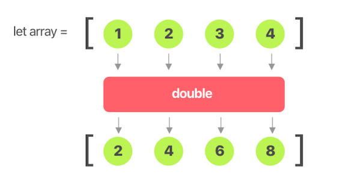

# Functional Programming (Part 1 of 2)

<!-- INSTRUCTOR NOTES:
1)  SOLUTION FOR ACTIVITY 2:
- Is in comments below Add'l Rsrcs
-->

## Minute-by-Minute

| **Elapsed** | **Time**  | **Activity**              |
| ----------- | --------- | ------------------------- |
| 0:00        | 0:05      | Objectives                |
| 0:05        | 0:15      | Initial Exercise          |
| 0:20        | 0:20      | Overview                  |
| 0:40        | 0:15      | In Class Activity I       |
| 0:55       | 0:10      | BREAK                     |
| 1:05      | 0:15     | Overview                  |
| 1:20        | 0:25      | In Class Activity II      |
| 1:45        | 0:05      | Wrap Up      |
| TOTAL       | 1:50      |                           |


## Learning Objectives (5 min)

By the end of this lesson, you should be able to...

1. Describe:
- the programming issues caused by __*mutable state*__
- the difference between __*Imperative*__ and __*Declarative*__ programming styles
- __*Functional Programming constructs*__ (`Pure Functions`, `Higher-Order Functions`, etc.) and the software issues FP is intended to solve
- potential use cases for FP
2. Implement basic examples of constructs explored in class, especially:
- `Pure Functions`
- the `map` function


## Initial Exercise (15 min)

Review solutions to last class's After Class assignment:  

- [Advanced coordinators in iOS - a tutorial](https://www.hackingwithswift.com/articles/175/advanced-coordinator-pattern-tutorial-ios)


## Overview/TT I (20 min)

###  Functional Programming

> “Functional programming is a programming paradigm &mdash; a style of building the structure and elements of computer programs &mdash; that treats computation as the evaluation of mathematical
> functions and avoids changing-state and mutable data.”
> – Wikipedia

### Why Learn This?

**Enemy of the State** <sup>1</sup> </br>
iOS and Mac apps rely heavily on __*state*__ to change their presentation and respond to input &mdash; it's hard to imagine writing an app without the use of __*properties*__ and __*variables.*__

In OOP, programs are composed of classes and objects. Statements, when executed, can mutate the state of objects.

However, __*state*__ is a __*huge source of needless complexity,*__ and __*responsible for most of the easily avoidable bugs*__ that users encounter. State management is difficult and error-prone.

Functional Programming (FP) seeks to avoid using mutable states by using functions as fundamental building blocks rather than variables.

Swift is not purely a functional programming language &mdash; we must always implement Cocoa frameworks that are mostly designed in an OOP manner &mdash; but Swift combines multiple programming paradigms to give you flexibility for app development, and it firmly embraces two key attributes of FP:

- **Higher-Order Functions** &mdash; Including map, filter, reduce, and compactMap.

- **Value Types** &mdash; Simple numerics, enums, and structs.


### Key Concepts

- **State (aka, Mutable State)** &mdash; Refers to a program's stored values at any given time.

- **Mutation** &mdash; The act of updating some state in-place.

 - **Higher-Order Functions** &mdash; a function that does at least one of the following:</br>
&nbsp;&nbsp;&nbsp; - takes one or more functions as arguments </br>
&nbsp;&nbsp;&nbsp; - returns a function as its result.

- **Imperative programming** &mdash; A programming paradigm that uses statements that change a program's state. Consists of commands for the computer to perform and implements algorithms in explicit steps.

&nbsp;&nbsp;&nbsp; - __*OOP*__ *typically follows the* __*Imperative Programming*__ *paradigm.*

- **Declarative programming** &mdash; Focuses on what the program should accomplish without specifying how the program should achieve the result. It seeks to minimize or eliminate *side effects* by describing __*what*__ the program must accomplish rather than describing __*how*__ to accomplish it.

&nbsp;&nbsp;&nbsp; - __*Functional Programming (FP)*__ *is considered a subset of* __*Declarative*__ </br>
&nbsp;&nbsp;&nbsp;&nbsp;&nbsp; __*Programming*__ *paradigm.*

- **Pure Functions** &mdash; A function is pure if it meets two criteria: </br>
&nbsp;&nbsp;&nbsp; - It always produces the same output if given the same input. </br>
&nbsp;&nbsp;&nbsp; - It does not produce external side effects (they do not change any data or state </br>
&nbsp;&nbsp;&nbsp;&nbsp;&nbsp; outside of themselves)


<!-- TODO: show example of pure function resolving state with side effects -->


### Problem(s) Addressed

`Variables` represent data &mdash; or *state.* By definition, since a `variable` can *vary* as your app runs, it fosters *mutable state.*

__*Imperative programming*__ &mdash; with mutable state &mdash; can lead to __*unintended consequences*__ of certain side effects.

#### Side Effects

*Side Effects* represent any changes to the state outside of a code block's current scope. Side effects might include:

- Changing the value of a variable
- Writing some data to disk
- Enabling or disabling a button in the User Interface

A function produces side effects if it modifies some variable's value (state) outside of the variable's local environment.

Not all side effects are unwanted. In fact, it is difficult to produce an iOS app without changing the state of some key variables.

However, uncontrolled side effects can cause unintended consequences: As apps grow, mutable state becomes harder to manage (and to test), especially
with concurrency for which mutable state can create dead-locks and race conditions.

<!-- TODO: example of Side Effects here -->


#### Benefits of FP

Benefits of applying immutability include:
- elimination of concurrency issues such as dead-locks and race conditions
- easy to create, test and maintain
- it promotes code with no side effects, no change of value in variables. And it leaves state in tact for future use
- cleaner code with less possibility for bugs. Because "variables" are not modified once defined, no change of state needs to tracked
- more opportunities for the compiler to optimize the code for performance

Functional code is less prone to bugs and easier to understand than imperative code, and it provides a modular, easy to maintain code base.


### Imperative vs. Declarative Code Style

##### Example 1

> First, create a type and an array to hold objects of the type.

```swift
class MyItem {
    var name: String
    var description: String

    init(name: String, description: String) {
        self.name = name
        self.description = description
    }
}

var myArr = [
    MyItem(name: "Abc", description: "Lorem ipsum 1."),
    MyItem(name: "Def", description: "Lorem ipsum 2."),
    MyItem(name: "Xyz", description: "Lorem ipsum 3.")
]
```

> With __*imperative programming,*__ you tell the compiler what you want to happen, __*step by step:*__

```swift
// Imperative approach
for item in myArr { // step through the array and decide if condition is met
    if item.name == "Def" {
        print("Yes")
    }
}
```

> With __*declarative programming,*__ you write code that describes **what** results are desired, but __*not*__ the step-by-step commands on **how** to achieve them:

```swift
// Declarative approach
if myArr.contains(where: { $0.name == "Def" }) {
    print("yes")
}
```

> Both attain the same result. But the imperative version walks through the array step-by-step, while the functional version
> simply passes a closure to the `.contains(where: )` function, which exists for every array object.


##### Example 2
> Consider how the following code is __*imperative.*__ Notice that we are manipulating the values inside a mutable array called numbers,
> and then printing to the console:

```swift
//Imperative Approach
var numbers = [1, 2, 3, 4, 5, 6, 7, 8, 9, 10]

for i in 0..<numbers.count {
    let timesTen = numbers[i] * 10
    numbers[i] = timesTen
}

print(numbers) //[10, 20, 30, 40, 50, 60, 70, 80, 90, 100]
```

> Now consider this alternative __*functional approach:*__

```swift
//Functional Approach
let numbers = [1, 2, 3, 4, 5, 6, 7, 8, 9, 10] // 1)

extension Array where Element == Int {

    func timesTen() -> [Int] { // 2)
        var output = [Int]()

        for num in self { // 3) and 4)
            output.append(num * 10)
        }
        return output
    }

}

let result = numbers.timesTen() // 4)

print(numbers) //[1, 2, 3, 4, 5, 6, 7, 8, 9, 10]
print(result) //[10, 20, 30, 40, 50, 60, 70, 80, 90, 100]
```

> Again, the results of the functional version are similar to that of the imperative one, except now:
> 1) The `numbers` array is now made immutable with the `let` keyword.
> 2) We moved the process of multiplying numbers into a method stored in an extension on Array.
> 3) Though still using a `for loop` and updating a variable called `output`, the scope of this variable is limited to the method.
> 4) The input argument (`numbers`) is being passed by value into the method, giving it the same scope as the output.

*from:* </br>
https://medium.com/swift2go/functional-programming-in-swift-an-introduction-253c1f420ca9


## In Class Activity I (15 min)

**TODO:**
1. Analyze the code in Example 2 above
2. Answer the following questions about it:

**Q:** What happens if another thread tries to access the `numbers` array during this process for:

- the imperative version?
- the functional version?

**Q:** What happens if we later want to access the original values stored in numbers?

- with the imperative version?
- with the functional version?

**Q:** How reliably can the code be tested using:

- the imperative version?
- the functional version?


## Overview/TT II (15 min)

### First-Class and Higher-Order Functions

**First-Class Functions:** </br>
True FP requires functions to be __*first class*__, and functions in Swift are *first class* citizens.

This means that functions are types, which allows us to treat them like values (variables) and to pass functions around like data: we can pass them into other functions as arguments, and even allows functions to return other functions.

Treating functions as types lets us combine different functions to create new functions with new behavior.

**Higher-Order Functions:** </br>
Every language with FP has some version of `Map`, `Filter`, `Reduce`, as does Swift.

These functions are called __*Higher-Order Functions (HoF)*__ because they can take other functions as their parameters.

Higher-Order Functions can be used to reduce repetition, refactor code, and to implement __*domain-specific languages (DSL).*__

In Swift, we can also develop our own Higher-Order Functions and DSLs.

### Functors and the `map` Function

FP employs concepts of a branch of mathematics called *Category Theory.* where a category is a collection of "objects."

In Category Theory, a *map*<sup>2</sup> between categories (object collections) is called a "functor."

The `map` function in Swift is a type of functor; it is a HoF that solves the problem of transforming the elements of a collection using a function.



&nbsp;&nbsp;&nbsp; *Use `map` to loop over a collection and apply the same operation to each element in the collection.*

</br>

&nbsp;&nbsp;&nbsp; [About the `map(_:)` function - from Apple Docs](https://developer.apple.com/documentation/swift/array/3017522-map): </br>
&nbsp;&nbsp;&nbsp; **Parameters** </br>
&nbsp;&nbsp;&nbsp;&nbsp;&nbsp;&nbsp; __*transform*__ &mdash; A mapping closure. transform accepts an element of this sequence as its parameter </br>
&nbsp;&nbsp;&nbsp;&nbsp;&nbsp;&nbsp; and returns a transformed value of the same or of a different type. </br>
&nbsp;&nbsp;&nbsp; **Return Value** &mdash; Returns an array containing the results of mapping the given closure </br>
&nbsp;&nbsp;&nbsp; over the sequence’s elements.

> <sup>2</sup> A **functor** is simply something that "can be mapped over," which means that you can take all the
> values  inside it, then for each value, derive something new out of it (by calling a function). You then put these
> resulting values back into a new container of the same structure and shape.


#### Example 1 - `map` with Array

> In this example, map is used first to convert the names in the array to lowercase strings and then to count their characters.

```swift
let cast = ["Vivien", "Marlon", "Kim", "Karl"]
let lowercaseNames = cast.map { $0.lowercased() }
// 'lowercaseNames' == ["vivien", "marlon", "kim", "karl"]
let letterCounts = cast.map { $0.count }
// 'letterCounts' == [6, 6, 3, 4]
```

#### Example 2 - `map`with Dictionary

The `map` function is not limited to arrays; you can use it on other collection types, too.

If you use `map` with a Swift `Dictionary` or `Set`, the return type will still always be a generic array, but you can return an array containing any type.

> Consider a dictionary with book names as key and the amount of each book as the value.

```swift
let bookAmount = ["harrypotter": 100.0, "junglebook": 60.00]
```

> The closure has arguments of types String and Double that were inferred from the types of the key and
> value that comprise each element of the dictionary.
> Notice that the contents of the array result returned by `map` is up to you:

```swift
let returnFromMap = bookAmount.map({ key, value in
//    print(key.capitalized)
//    print(value * 10)
    return(key.capitalized, value * 10)
})

// print the mapped array returned...
print(returnFromMap) // [("Harrypotter", 1000.0), ("Junglebook", 600.0)]
```

*From:* </br>
https://medium.com/@abhimuralidharan/higher-order-functions-in-swift-filter-map-reduce-flatmap-1837646a63e8


## In Class Activity II (25 min)

### Individually

1. Here is an imperative version of a function called `doubleIt` that takes an array of numbers and returns a new array after doubling every item in the initial array:

```swift
func doubleIt(inputArray: Array<Int>) {

    var results = [Int]()

    for num in inputArray {
        results.append(num * 2)
    }
    print(results)
}

doubleIt(inputArray: [1,2,3]) // [2,4,6]
```

**TODO:** 

1. Code the declarative (FP) version of `doubleIt`so that it achieves the same result as the code above by using the `map` function instead of the `for loop`

<!-- 
```swift
func doubleIt(inputArray: Array<Int>) {

    // TODO: Use map here...
    let results = ??
    print(results)
}

doubleIt(inputArray: [1,2,3]) // [2,4,6]
```
-->

2. Given an array of Users which have properties name:String and age:Int:
   - write a `map` function that returns an array of strings consisting of the user’s names

3. Take the initial array of Users from the exercise above and, using `map`, convert it to a Dictionary

4. Given an array of dictionaries containing keys for “name” and “age”:
   - write a `map` function that returns an array of users created from it

*From:* </br>
https://www.weheartswift.com/higher-order-functions-map-filter-reduce-and-more/


## After Class

1. Research:

- Referential Transparency
- Equational Reasoning
- Currying
- Monad
- Applicative Functor
- Deterministic
- Side Effects (as it related to CS)

2. The tutorial below demonstrates FP using a game as the example. Study and execute it, completing as much of it as you can, but at the very least complete the steps from the beginning through the section on the `Reduce` function:

&nbsp;&nbsp;&nbsp; https://troz.net/post/2018/functional-programming/

3. Continue working on your Course Project...


## Wrap Up (5 min)

- Continue working on your Course Project...
- Complete reading
- Complete challenges/assignments

## Additional Resources

1. [Slides](https://docs.google.com/presentation/d/1yOC0-DvyG7Pgc_9vffqkZK8dodVcDBvsq1RGPs3ln7g/edit#slide=id.g514277a126_0_184)
2. [Functional programming - wikipedia](https://en.wikipedia.org/wiki/Functional_programming)
3. [Enemy of the State](https://speakerdeck.com/jspahrsummers/enemy-of-the-state?slide=5) <sup>1</sup>
4. [Controlling Complexity - an article by Andy Matuschak](https://realm.io/news/andy-matuschak-controlling-complexity/)
5. [State - wikipedia](https://en.wikipedia.org/wiki/State_(computer_science))
6. [Imperative programming - wikipedia](https://en.wikipedia.org/wiki/Imperative_programming)
7. [Declarative programming - wikipedia](https://en.wikipedia.org/wiki/Declarative_programming)
8. [Higher-order_function - wikipedia](https://en.wikipedia.org/wiki/Higher-order_function)
9. Domain-Specific Languages (DSLs):
- [Domain-Specific Languages - wikipedia](https://en.wikipedia.org/wiki/Domain-specific_language)
- [A book by Martin Fowler](https://www.martinfowler.com/books/dsl.html)


<!-- SOLUTION FOR ACTIVITY 2:

func doubleIt(inputArray: Array<Int>) {
    let results = inputArray.map({ $0 * 2 })
    print(results)
}

doubleIt(inputArray: [1,2,3]) // [2,4,6]
-->
