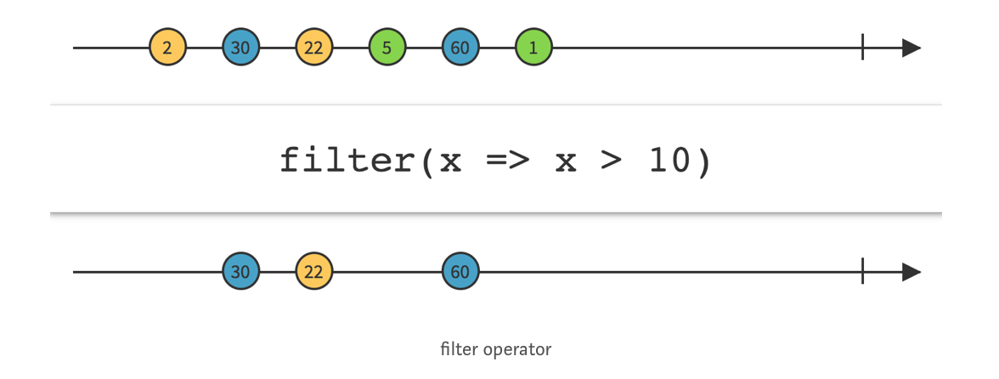

# Reactive Programming (Part 1 of 2)

<!-- INSTRUCTOR NOTES:
1) For Activity 1:
- solutions are hidden (as graphics) below each exercise
3) for Activity 2:
- xxxx
-->

## Minute-by-Minute

| **Elapsed** | **Time**  | **Activity**              |
| ----------- | --------- | ------------------------- |
| 0:00        | 0:05      | Objectives                |
| 0:05        | 0:20      | Initial Exercise          |
| 0:25        | 0:20      | Overview                  |
| 0:45        | 0:15      | In Class Activity I       |
| 1:00        | 0:10      | BREAK                     |
| 1:10        | 0:20      | Overview                  |
| 1:30        | 0:25      | In Class Activity II      |
| TOTAL       | 1:55      |                           |


## Learning Objectives (5 min)

By the end of this lesson, you should be able to...

1. Describe:

<!-- Reactive programming
ReactiveX (Rx)
brief History
problems it is intended to solve, benefits or how it solves them
RxSwift and RxCocoa
how to read Marble diagrams
Basic Building blocks
some basic operators
concepts:
- Event Streams, Sequences, Observables (and their relationship)
Lifecyce of Observables
implement basic examples of:
- Observables -->

<!--
1. Describe:
- the **xxxx** design pattern
- the software construction problem(s) it is intended to solve
- potential use cases for it (when to use it; when not to use it)
3. Assess:
- the suitability of a given design pattern to solve a given problem
- the trade offs (pros/cons) inherent in choosing high-level (MVC, MVVM, etc.) design patterns
4. Implement basic examples of MVVM explored in this class -->


## Overview/TT I (20 min)

### Reactive Programming

Reactive Programming can be thought of as the practice of programming with *asynchronous* data streams, or __*event streams.*__

#### Initial Concepts

In Reactive Programming, an observer *subscribes* to __*an Observable.*__

Observables produce events over a period of time. The process of Observables producing events over a time is referred to as __*emitting.*__

And the observer can react to whatever item or sequence of items the Observable emits.

Events can contain values, including numbers or instances of a custom type, or events can be recognized gestures, such as taps.

__*Operators*__ are __*the building blocks*__ of Reactive Programming, which you can use to transform, process, and react to events emitted by observables.

##### Event Streams
An event stream is a sequence of events happening over time.

An asynchronous data stream is a stream of data where values are *emitted* &mdash; one after another &mdash; with a delay between them, and without blocking program flow to wait for results (Parallelism).

And because the stream is asynchronous, the data emitted can appear anywhere in time &mdash; after a second or two, or even after two minutes.

#### Modeling Event Streams with Marble Diagrams

The common way of modeling asynchronous streams in Rx is to place the emitted values on a time axis in what is called a **Marble Diagram** &mdash; interactive diagrams that depict how Rx operators work with observable sequences over time.

Here, our diagram shows a simple description of a hypothetical event stream, with events represented by colored bubbles drawn at intermittent time intervals:

 </br>

In a Marble Diagram, the left-to-right arrow represents time, and the numbered circles represent elements of a sequence, which are just values plotted on the timeline.

In the last above diagram, pay particular attention to these symbols:
- The **Error** symbol
- The **Event Stream Complete** symbol  

<!-- TODO: add why the relevance of these symbols will be clear soon -->


##### Comparing Arrays to Event Streams

Arrays are sequences in *space*; all items in an array exist in memory.

Event streams, on the other hand, may not exist in space. Events might only occur *over time,* and you may not know all the events that will or can happen, or even when they will occur.

If we consider the scenario in which `eventStreamArray` below started as an empty array (i.e., didn't exist in memory), and each element was populated one-at-a-time over a period of time, then the array will act like an event stream where event  1 (populating `eventStreamArray` with the first element, 2) might happen at the 1st second, event 2 might happen at the 4th second, and so on...

```Swift
  var eventStreamArray = [2, 30, 22, 5, 60, 1]
```

**Diagramming the `filter()` Operator** </br>
One of the most commonly-used Rx operators, `filter()` only emits items from an Observable if a specific condition is met.

In this example, the filtered condition applied to the `eventStreamArray` above is to emit into the resulting stream only those items whose values are `greater than 10`:




## In Class Activity I (30 min)

### In Pairs or As A Class
Marble Diagrams are indispensable when it comes to learning Rx.

Below are 3 Marble Diagrams of hypothetical, generic event scenarios that illustrate 3 of the most commonly used Rx __*transforming operators.*__

However, all 3 diagrams are incomplete: They are all missing the timeline showing the event stream resulting from each of their respective operators.

> __*TIP:*__ You should be familiar with how the first 2 operators work; they are very similar to their HoF counterparts found in the standard Swift libraries, except they work with Observable sequence elements.

**TODO:**
- Study each one of the diagrams and the description of each operator.
- Complete the diagram by filling in the resulting event stream for each operator (*see the `filter()` operator diagram above for hints*).

__*Exercise 1:*__ `map()` &mdash; Transforms items emitted by an Observable by applying a function to each item or converting from one item type into another:


<!--

 -->

__*Exercise 2:*__ `reduce()` &mdash; Applies a function to each item emitted by an Observable, sequentially, and emits the final value:


<!-- 
 -->

__*Exercise 3:*__ &mdash; The `distinct()` suppresses duplicate items emitted by an Observable:

 
 <!--  -->


## Overview/TT II  (20 min)

### ReactiveX, RxSwift & RxCocoa

ReactiveX (Rx) is a combination of the best ideas from the **Observer pattern,** the **Iterator pattern,** and **Functional Programming.**

It is a library for composing asynchronous and event-based programs by using observable sequences.

It extends the observer pattern to support **sequences** of data and/or events, and it adds **operators** which allow you to compose sequences together declaratively while abstracting away concerns regarding concurrency.

#### Brief History

Around 2009, a team at Microsoft released a new client and server side framework called Reactive Extensions for .NET that offered a solution to the problems of real-time, scalable, asynchronous app development.

It soon became a built-in core library in the .NET framework.

In 2012, it became an open-source component permitting other languages and platforms to reimplement the same functionality.

Today, it is a cross-platform standard implemented in RxJS, Rx.NET, RxScala, RxSwift, and more...

 > http://reactivex.io is the central repository of documentation about Rx’s operators and core classes.

#### RxSwift & RxCocoa

**RxSwift** also works with all the concepts you’ve covered so far: It tackles mutable state, it allows you to compose event sequences and improves on architectural concepts such as code isolation, reusability and decouplings.

You could think of RxSwift as the "glue" between traditionally imperative Cocoa Touch code and functional code. It allows you to react to events by using __*immutable*__ code definitions to process __*asynchronous*__ pieces of input in a __*deterministic,*__ __*composable*__ manner.

Because RxSwift closely follows the general API design that RxPython, RxRuby, RxJS, and all other platforms conform to, it does not include any specific features or integrations with UIKit or Cocoa Touch to aid you in developing for iOS.

**RxCocoa** is a standalone library that comes bundled with RxSwift. It allows you to use many prebuilt features to integrate better with UIKit and Cocoa Touch. RxCocoa will provide you with out-of-the-box classes to do reactive networking, react to user interactions, bind data models to UI controls, and more.

<!-- TODO: describe RxCocoa' use cases, details better -->

#### Why learn this?

##### Benefits

The [Rx Documentation](http://reactivex.io) states these as the general benefits of **ReactiveX:**

- **Functional** &mdash; Avoid intricate stateful programs, using clean input/output functions over observable streams.
- **Less is more** &mdash; ReactiveX's operators often reduce what was once an elaborate challenge into a few lines of code.
- **Async error handling** &mdash; Traditional try/catch is powerless for errors in asynchronous computations, but ReactiveX is equipped with proper mechanisms for handling errors.
- **Concurrency made easy** &mdash; Observables and Schedulers in ReactiveX allow the programmer to abstract away low-level threading, synchronization, and concurrency issues.

The benefits of implementing **RxSwift** are more evident in modern mobile apps which are highly interactive and have a multitude of UI events related to data events.

The benefits of **RxSwift** include:
- Asynchrony is simplified with Declarative Code.
- Multithreading is simplified.
- Cleaner Code & Architectures
- Composable Components.
- Perfect compatibility with the MVVM template


####  Problems Solved

By now, you are familiar with the issues inherent in the following:

1. State, especially shared mutable state
2. Imperative programming
3. Side effects

In addition to those issues, Rx specifically addresses challenges associated with __*asynchronous*__ operations.

#### Asynchronous

At any given moment, your iOS app might be executing any of the following asynchronous tasks:
- Reacting to button taps and gestures
- Animating the keyboard as a text field loses focus
- Downloading a large photo from the Internet
- Saving bits of data to disk
- Playing audio
- Tracking GPS location updates

And if any 2 tasks occur at the same time &mdash; as they often do &mdash; one task should not block the execution of the other.

For example, reacting to user taps on a button should not have to wait for GPS location updates to complete.

As a platform, iOS offers numerous APIs to write such asynchronous code. Examples include:
- closures for small Async tasks
- delegation for background task
- Notification Center for event-based tasks...

Managing and modifying a single code base comprised of multiple Asynchronous APIs becomes difficult, especially with a large development team.

By its nature, Asynchronous code presents common issues such as race conditions, difficulty Unit Testing, and more...

<!-- TODO: elaborate on all this... -->

<!--
TODO: Show synchronous? -->


### How Rx solves them

1. **Declarative code** &mdash; RxSwift combines some of the best aspects of imperative code and functional code to resolve challenges presented by mutable state, etc.

2. **Reactive systems**

This is an abstract term covering web or iOS apps that exhibit most or all of the following qualities:
- __*Responsive:*__ Always keep the UI up to date, representing the latest app state.
- __*Resilient:*__ Each behavior is defined in isolation and provides for flexible error
recovery.
- __*Elastic:*__ The code handles varied workload, often implementing features such as lazy pull-driven data collections, event throttling, and resource sharing.
- __*Message driven:*__ Components use message-based communication for improved reusability and isolation, decoupling the lifecycle and implementation of classes.
Now that you have a good understanding of the problems RxSwift helps solve and how it approaches these issues, it’s time to talk about the building blocks of Rx and how they play together.


####  Basic Building blocks

- Observables
- Subscribing
- Subject
- Dispose
- DisposeBag
- Schedulers
- Operators

<!--
### More on Streams

The word asynchronous means that the data emitted can appear anywhere in time, after one second or even after two minutes, for example.

An event stream can be anything like keyboard inputs, button taps, gestures, GPS location updates, accelerometer, iBeacon, and such.

You can listen to a stream and react to it accordingly.


Event streams (a sequence of events that happen over time).

“In its basic form, it deals with event streams (a sequence of events that happen over time).

Whenever an event occurs, we react to it by doing something.

We could react to events by using for loops but in Functional Programming the transformations are done via map(), filter() and other Rx operators.”


Examples of event streams.

Examples of async event streams.
at any moment, might be doing any of the following things and more:
• Reacting to button taps and gestures
• Animating the keyboard as a text field loses focus
• Downloading a large photo from the Internet
• Saving bits of data to disk
• Playing audio -->


### Observables (aka, Sequences)

The most important thing to understand about Rx is the equivalence<sup>1</sup> of the observer pattern (`Observable<Element>` sequence) and normal sequences (`Sequence`).

And the kernel of RxSwift is:
- Every Observable sequence is just a sequence with some special powers, the most important of its powers is that it is __*asynchronous.*__
- Event Streams are called sequences.
- The key advantage for an Observable vs Swift's `Sequence Type`<sup>2</sup> is that Observable can also receive elements __*asynchronously.*__

Thus, in RxSwift, everything is a sequence or something that works with a sequence (and you can refer to Observables and event streams interchangeably as "sequences.")

Other attributes of Observable:

- Every Observable is __*immutable,*__ which means that each stream composition will create a completely new Observable.
- `ObservableType.subscribe` method is equivalent to `Sequence.makeIterator` method.
- Observer (callback) needs to be passed to `ObservableType.subscribe` method to receive sequence elements *instead of calling `next()` on the returned iterator.*


Arrays, Strings or Dictionaries will be converted to observable sequences in RxSwift. (In fact, you might think of an array converted to an observable sequence as simply an array with time dimension.)

You can create an observable sequence of any object that conforms to the `Sequence Protocol` from the Swift Standard Library.


<!-- Observable is an array with time dimension -->

<!-- Observable(ObservableType) is equivalent to Sequence -->
<!-- Observables produce events, the process of which is referred to as emitting, over a period of time. -->

<!-- A stream is a sequence of ongoing events ordered in time. It can emit three different things: a value (of some type), an error, or a "completed" signal. -->


#### Lifecycle of an Observable

An Observable can emit (and observers can receive) only three types of events:
- A **Next** event &mdash; An event that “carries” the latest (or "next") data value. This is the way observers “receive” values. An Observable may emit an indefinite amount of these values, until a terminating event is emitted.

A **Completed** event  &mdash;  This event terminates the event sequence with success. It means the Observable completed its life cycle successfully and won’t emit additional events.

- An **Error** event  &mdash; The Observable terminates with an error and will not emit additional events.


But an Observable doesn’t do anything until it receives a subscription.


### Subscribing to Observables

< compare to Notifications >


Subscribes an element handler, an error handler, a completion handler and disposed handler to an observable sequence.

     - parameter onNext: Action to invoke for each element in the observable sequence.
     - parameter onError: Action to invoke upon errored termination of the observable sequence.
     - parameter onCompleted: Action to invoke upon graceful termination of the observable sequence.
     - parameter onDisposed: Action to invoke upon any type of termination of sequence (if the sequence has
     gracefully completed, errored, or if the generation is canceled by disposing subscription).
     - returns: Subscription object used to unsubscribe from the observable sequence.

    public func subscribe(onNext: ((Element) -> Void)? = nil, onError: ((Swift.Error) -> Void)? = nil, onCompleted: (() -> Void)? = nil, onDisposed: (() -> Void)? = nil)


### Disposing and terminating


<!--
### Common operators in swift

 -->


## In Class Activity II (30 min)


## Overview/TT III  (20 min)

## In Class Activity III (30 min)


## After Class

- Rx Backpressure Operators


## Wrap Up (5 min)

- Continue working on your current tutorial
- Complete reading
- Complete challenges

## Additional Resources

1. [Slides]()

<!-- TODO: attribute this... -->
https://medium.com/@jshvarts/read-marble-diagrams-like-a-pro-3d72934d3ef5

equivalence<sup>1</sup>
https://github.com/ReactiveX/RxSwift/blob/master/Documentation/MathBehindRx.md

<sup>2</sup>
(https://developer.apple.com/documentation/swift/sequence)
