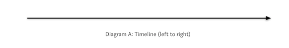

# Reactive Programming (Part 1 of 2)

<!-- INSTRUCTOR NOTES:
1) For the QuizLet Game in the Initial Exercise:
- the URL is xxxx
2) For Activity 1:
- xxx
3) for Activity 2:
- xxxx
-->

## Minute-by-Minute

| **Elapsed** | **Time**  | **Activity**              |
| ----------- | --------- | ------------------------- |
| 0:00        | 0:05      | Objectives                |
| 0:05        | 0:20      | Initial Exercise          |
| 0:25        | 0:20      | Overview                  |
| 0:45        | 0:15      | In Class Activity I       |
| 1:00        | 0:10      | BREAK                     |
| 1:10        | 0:20      | Overview                  |
| 1:30        | 0:25      | In Class Activity II      |
| TOTAL       | 1:55      |                           |


## Learning Objectives (5 min)

By the end of this lesson, you should be able to...

1. Describe:
- the **xxxx** design pattern
- the software construction problem(s) it is intended to solve
- potential use cases for it (when to use it; when not to use it)
3. Assess:
- the suitability of a given design pattern to solve a given problem
- the trade offs (pros/cons) inherent in choosing high-level (MVC, MVVM, etc.) design patterns
4. Implement basic examples of MVVM explored in this class


## Overview/TT I (20 min)

### Reactive Programming using RxSwift

#### Modeling Event Streams with Marble Diagrams

##### Event Streams

Reactive Programming (Rx) can be thought of as the practice of programming with *asynchronous* data streams, or __*event streams.*__

An event stream is a sequence of events happening over time.

An asynchronous data stream is a stream of data where values are *emitted* &mdash; one after another &mdash; with a delay between them, and without blocking program flow to wait for results (Parallelism).

And because the stream is asynchronous, the data emitted can appear anywhere in time &mdash; after a second or two, or even after two minutes.

For examples, your iOS app might be doing any of the following at any particular moment:
- Reacting to button taps and gestures
- Animating the keyboard as a text field loses focus
- Downloading a large photo from the Internet
- Saving bits of data to disk
- Playing audio
- Tracking GPS location updates

##### Marble Diagrams

The common way of modeling asynchronous streams in Rx is to place the emitted values on a time axis in what is called a **Marble Diagram** &mdash; interactive diagrams that depict how Rx operators work with observable sequences over time.

This first Marble Diagram depicts a timeline by itself, with no items being emitted, illustrating that you read Marble Diagrams from left to right:




The following diagram shows a simple description of a hypothetical event stream, with events represented by colored bubbles drawn at intermittent time intervals:


Pay close attention to the following symbols in this diagram:
- The **Error** symbol
- The **Event Stream Complete** symbol  

<!-- TODO: add why the relevance of these symbols will be clear soon -->


##### Diagramming an Array...

We can compare an event stream to an array:

Arrays are sequences in *space*; all items in an array exist in memory.

Event streams, on the other hand, may not exist in space. Events might only occur *over time,* and you may not know all the events that will or can happen, or even when they will occur.


```Swift
  var eventStreamArray = [2, 30, 22, 5, 60, 1]
```
If we can consider the scenario in which `eventStreamArray` started as an empty array (i.e., didn't exist in memory), and each element was populated one-at-a-time over a period of time, then the array will act like an event stream where an event  1 (populating `eventStreamArray` with the first element, 2) might happen at the 1st second, event 2 might happen at the 4th second, and so on...


filter()
One of the most commonly-used Rx operators, `filter()` only emits items from an Observable if a specific certain condition is met.

In this example, the filter condition applied to `eventStreamArray` is to emit into the resulting stream only those items whose values are `greater than 10`:


So if we have to relate between an array and event stream, then we can assert that if the ["1", "2", "abc",  "3", "4", "cdf", "6"] values happen over a period of time and don't just exist in memory from scratch, the preceding array will act like an event stream where an event "1" might happen at 1st second, event "2" may happen at the 4th second,


Let's try to compare eventStream to an array; arrays are sequences in space, which means all the items in the eventStream array now exist in memory; on the other hand, eventStreams don't have that property. Events might happen over time and you won't even know all the items that might happen and when will they happen.


< comparing Arrays as event streams


## In Class Activity I (30 min)


Marble Diagrams are indispensable when it comes to learning Rx.


## Overview/TT II  (20 min)


#### What it is


<!-- Iterator & Observer pattern -->


#### Why learn it

< general reason >

Problems solved by Rx
-
### Problems solved and how xxxx


#### synchronous vs asynchronous

How Rx solves them


#### Brief History

#### RxSwift & RxCocoa


####  Basic Building blocks


### Sequences


But in RxSwift, Event Streams are called sequences.

in RxSwift, everything is a sequence or something that works with a sequence.


### More on Streams

The word asynchronous means that the data emitted can appear anywhere in time, after one second or even after two minutes, for example.

An event stream can be anything like keyboard inputs, button taps, gestures, GPS location updates, accelerometer, iBeacon, and such.

You can listen to a stream and react to it accordingly.


Event streams (a sequence of events that happen over time).

“In its basic form, it deals with event streams (a sequence of events that happen over time).

Whenever an event occurs, we react to it by doing something.

We could react to events by using for loops but in Functional Programming the transformations are done via map(), filter() and other Rx operators.”


Examples of event streams.

Examples of async event streams.
at any moment, might be doing any of the following things and more:
• Reacting to button taps and gestures
• Animating the keyboard as a text field loses focus
• Downloading a large photo from the Internet
• Saving bits of data to disk
• Playing audio


### Observables


And an Observable is just a sequence, with some special powers. One of these powers — in fact the most important one — is that it is asynchronous. Observables produce events, the process of which is referred to as emitting, over a period of time.


Observable is an array with time dimension


Subject
Marble diagrams
schedulers

### Common operators in swift


## In Class Activity II (30 min)


## Overview/TT III  (20 min)

## In Class Activity III (30 min)

## Wrap Up (5 min)

- Continue working on your current tutorial
- Complete reading
- Complete challenges

## Additional Resources

1. [Slides]()

<!-- TODO: attribute this... -->
https://medium.com/@jshvarts/read-marble-diagrams-like-a-pro-3d72934d3ef5
