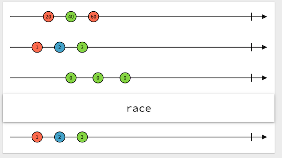

# Reactive Programming (Part 2 of 3)

<!-- INSTRUCTOR NOTES:
1) For the QuizLet Game in the Initial Exercise:
- the URL is xxxx
2) For Activity 1:
- xxx
3) for Activity 2:
- xxxx
-->

## Minute-by-Minute

| **Elapsed** | **Time**  | **Activity**              |
| ----------- | --------- | ------------------------- |
| 0:00        | 0:05      | Objectives                |
| 0:05        | 0:20      | Initial Exercise          |
| 0:25        | 0:20      | Overview                  |
| 0:45        | 0:15      | In Class Activity I       |
| 1:00        | 0:10      | BREAK                     |
| 1:10        | 0:20      | Overview                  |
| 1:30        | 0:25      | In Class Activity II      |
| TOTAL       | 1:55      |                           |


## Learning Objectives (5 min)

The three building blocks of Rx code are __*Observables,*__ __*Operators*__ and __*Schedulers.*__

By the end of this lesson, you should be able to...

1. Describe and implement basic examples of:
- Optional ways for creating **Observables**  
- **Hot & Cold** Observables
- **Subjects** - A special type of Observable
- **Schedulers**
- Key Rx **Operators** selected from the roster of operator types available in RxSwift/RxCocoa

## Initial Exercise (15 min)

### Part 1 - Questions from Previous Class

1. How does `distinctUntilChanged` work?

It's a variation of `Distinct`. It suppresses sequential duplicate elements emitted by an Observable sequence.

This method will emit values *only* if they are different from the previous value.

Note that in the example below, the 🐱 image was listed 3 times in a row in the middle of the sequence, but because the 🐱 at positions 4 and 5 were both preceded by the same 🐱 element, the 🐱 elements at those positions are ignored and not emitted.

```Swift
  example("distinctUntilChanged") {
      let disposeBag = DisposeBag()

      Observable.of("🐱", "🐷", "🐱", "🐱", "🐱", "🐵", "🐱")
          .distinctUntilChanged()
          .subscribe(onNext: { print($0) })
          .disposed(by: disposeBag)
  }

// OUTPUT:
🐷
🐱
🐵
🐱
```

 </br>

*From:* </br>
http://reactivex.io/documentation/operators/distinct.html
http://introtorx.com/Content/v1.0.10621.0/05_Filtering.html#Distinct


2. What does `race` operator do?

Returns an Observable that mirrors the first source Observable to emit an item.

> TODO: Bring up the image of the  `race` operator in the URL below and move the 1, 2, and 3 circles past the first 0 circle. Result: the sequence returned will now be 20, 40, 60...

 </br>

https://rxmarbles.com/#race


*Definition from:* </br>
https://rxjs-dev.firebaseapp.com/api/index/function/race

> *Note: It is inconclusive, but the `race` operator may also be the same the the `amb` operator listed in the generic Rx operators.*


3. `buffertoggle` and `bufferWhen` operators?

> TODO: To understand these operators, experiment with their interactive Marble Diagrams...

`Buffer`
periodically gather items emitted by an Observable into bundles and emit these bundles rather than emitting the items one at a time

`buffertoggle`
Collects values from the past as an array. Starts collecting only when opening emits, and calls the closingSelector function to get an Observable that tells when to close the buffer.

`bufferWhen`
Collects values from the past as an array. When it starts collecting values, it calls a function that returns an Observable that tells when to close the buffer and restart collecting.

*Definitions from:* </br>
http://reactivex.io/documentation/operators/buffer.html
http://reactivex.io/rxjs/class/es6/Observable.js~Observable.html#instance-method-bufferToggle
http://reactivex.io/rxjs/class/es6/Observable.js~Observable.html#instance-method-bufferWhen

> *Note: It is inconclusive, if these operators exist in RxSwift of RxCocoa.*

4. Why would there be __*retain cycles*__ with __*Observables*__?

__*Inside closures*__

> "When working with closures when you are pointing to self inside closure... a retain cycle gets created if you DON'T use `[weak/unowned self]`."

https://stackoverflow.com/questions/35003355/weak-self-in-rxswift-closures

__*DisposeBags*__
> "using a DisposeBag sometimes leads to memory leaks. Remember that every operator keeps a strong reference to dependencies used in its closure. If it is self it is also kept by the Observable. As a result, you have a retain cycle."

http://adamborek.com/memory-managment-rxswift/


<!-- x. Why call `.subscribe` be on the Observable not the Observer? -->


### Part 2 - Activity 2 from Previous Class

...continuation of Lesson 11 -> Activity 2 -> Exercise 3


## Overview/TT I (20 min)


 </br>


<!-- MORE on Observables -->

### Observables (continued...)


#### Ways to Create Observables

**create** &mdash; Creates a custom Observable sequence.

```Swift
example("create") {
    let disposeBag = DisposeBag()

    let myJust = { (element: String) -> Observable<String> in
        return Observable.create { observer in
            observer.on(.next(element))
            observer.on(.completed)
            return Disposables.create()
        }
    }

    myJust("🔴")
        .subscribe { print($0) }
        .disposed(by: disposeBag)
}
```

`error` &mdash; Creates an Observable sequence that emits no items and immediately terminates with an error.

```Swift
  example("error") {
      let disposeBag = DisposeBag()

      Observable<Int>.error(TestError.test)
          .subscribe { print($0) }
          .disposed(by: disposeBag)
  }
```


`from` &mdash; Creates an Observable sequence from a Sequence, such as an Array, Dictionary, or Set.

```Swift
  example("from") {
      let disposeBag = DisposeBag()

      Observable.from(["🐶", "🐱", "🐭", "🐹"])
          .subscribe(onNext: { print($0) })
          .disposed(by: disposeBag)
  }
```

**just**  &mdash; Creates an Observable sequence with a single element.

```Swift
  example("just") {
      let disposeBag = DisposeBag()

      Observable.just("🔴")
          .subscribe { event in
              print(event)
          }
          .disposed(by: disposeBag)
  }
```

<!-- .create() method for Observables
.retry(3)
     .debug() -->


     <!-- illustrate 3 from the Rx.playground
     			analyze what they do differently -->

<!-- < TODO: Get examples -->


```Swift

```


```Swift

```


```Swift

```


<!-- compare Notifications to Observables? -->


#### Comparing Observables with iOS Notifications

<!-- TODO: both use Observer pattern -->

<!-- THIS needs the same example as an Observable
- also, most examples converting notifications have MainScheduler -->


, you may be familiar with NotificationCenter; it broadcasts notifications to observers, which are different than RxSwift Observables. Here’s an example of an observer of the UIKeyboardDidChangeFrame notification, with a handler as a trailing closure:


Subscribing to an RxSwift observable is fairly similar; you call observing an observable subscribing to it. So instead of addObserver(), you use subscribe(). Unlike NotificationCenter, where developers typically use only its .default singleton instance, each observable in Rx is different.


More importantly, an observable won’t send events, or perform any work, until it has a
subscriber.
Remember that an observable is really a sequence definition; subscribing to an observable is really more like calling next() on an Iterator in the Swift standard library.


```Swift

```


```Swift

```

 </br>


#### Debugging

<!-- < TODO: add Debugging here, simple examples-->

<!-- .debug operator -->
<!-- Debugging:
debug - Prints out all subscriptions, events, and disposals.
RxSwift.Resources.total - Provides a count of all Rx resource allocations, which is useful for detecting leaks during development. -->


<!-- < TODO: add Debugging here, simple examples-->


```Swift

```


```Swift

```


```Swift

```


```Swift

```


#### Hot & Cold** Observables
<!-- Hot and cold observables  -->


<!-- TODO: insert the standard comparison chart -->

 </br>


## In Class Activity I (10 min)

<!-- < TODO: observable exercises ??-->

<!-- TODO: convert a Notification to an Observable? -->


<!-- TODO: convert a dictionary to an Observable? -->


<!-- TODO: start an Observable from scratch -->


<!-- < TODO: with debugging options ??-->


```Swift

```

```Swift

```

## Overview/TT II (20 min)

### Subject

<!-- TODO: start with stating it is a Hot, then describe.  -->

<!-- TODO: give 2 progressive examples  -->


```Swift

```


```Swift

```
### Scheduler

<!-- TODO: show 2 scheduer examples - 1 from rx.playground -->


- $1


```Swift

```


```Swift

```

## In Class Activity II (30 min)

<!-- TODO: get exercises for subject  -->


```Swift

```

## Overview/TT III (20 min)

### Operators

<!-- TODO: list the 4 types -->

<!-- TODO: pick a couple and show examples...esp. those that the class was confused by -->

<!-- TODO: end: You can create your own - show link  -->


<!-- takeUntil
distinctuntilchanged
race
combineLatest
buffertoggle -->


```Swift

```


## In Class Activity III (30 min)

<!-- TODO: get exercises for Operators  -->


```Swift

```

## After Class

Research:

- Single, Completable, and Maybe (special types of Observables)


<!-- TODO: get an exercise for Schedulers; 1st, review it in rx.playground, then do an exercise (convert something?) -->

<!-- < TODO: exercise on debugging with RxSwift.Resources.total -->


## Wrap Up (5 min)

- Continue working on your current tutorial
- Complete reading
- Complete challenges

## Additional Resources

1. [Slides]()
2.


https://en.wikipedia.org/wiki/Reactive_extensions


https://github.com/RxSwiftCommunity/RxSwiftExt

https://github.com/RxSwiftCommunity

https://community.rxswift.org


https://en.wikipedia.org/wiki/Reactor_pattern
